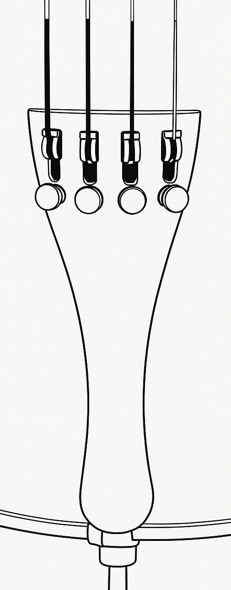
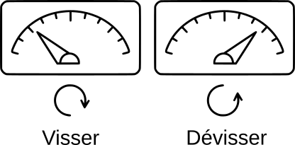

<!-- BEGIN ARISE ------------------------------
Title:: "Comment accorder son violoncelle"

Author:: "Guillaume Machiels"
Description:: "Cet article explique pas à pas comment accorder un violoncelle : présentation des cordes, utilisation d’un accordeur électronique, astuces pour tourner les tendeurs dans le bon sens et précautions à prendre avec les chevilles afin d’éviter de casser une corde."
Language:: "fr"
Thumbnail:: ""
Published Date:: "2025-08-21"
Modified Date:: "2025-08-21"

toc:: "false"
process_markdown:: "true"
content_header:: "true"
---- END ARISE \\ DO NOT MODIFY THIS LINE ---->

## 1. Découvrir les cordes  
- Le violoncelle a **4 cordes** : **Do – Sol – Ré – La** (de la plus grave à la plus aiguë).  
- On accorde le plus souvent avec les **tendeurs** (au cordier).  
- Les **chevilles** (en haut du manche) servent surtout pour les gros ajustements, mais elles sont plus délicates : ⚠️ à manier avec précaution.  

---

## 2. Utiliser un accordeur électronique  

- Allume ton accordeur et choisis le mode **chromatique**.  
- Joue doucement une corde avec l’archet ou en pizzicato.  
- Lis l’écran :  
  -- Si l’aiguille ou le voyant va **à gauche** → la corde est trop **grave**.  
  -- Si ça va **à droite** → la corde est trop **aiguë**.  
	-- ⚠️ Vérifie toujours que l’accordeur indique **la bonne note** 

	(exemple : *A* ⭢ **La**, *D* ⭢ **Ré**, *G* ⭢ **Sol**, *C* ⭢ **Do**).  

---

## 3. 📱 Utiliser ton smartphone comme accordeur  
- Un smartphone peut remplacer l’accordeur électronique.  
- Il existe des **applications gratuites et simples** qui fonctionnent très bien.  
- Je recommande l’application **LikeTones – Accordeur Violoncelle** :  

<a
href="https://play.google.com/store/apps/details?id=com.sonkins.tcello&pcampaignid=web_share"
target="_blank" rel="noopener"
class="border border-green-600 inline-flex items-center gap-2 px-5 py-3 font-semibold rounded-xl shadow active:scale-[0.99] transition"
>
Télécharger sur le Play Store
</a>

  

---

## 4. Régler les tendeurs (cordier)  
  

- **Visser ⭮** (tourner comme une horloge) = corde plus tendue = son plus **aigu**.  
- **Dévisser ⭯** (tourner dans l’autre sens) = corde plus lâche = son plus **grave**.  
- ✅ Astuce à retenir : *Tourner comme l’horloge → la corde monte !*  

  

---

## 5. Utiliser les chevilles (haut du manche)  
- ⚠️ Les chevilles sont sensibles et demandent de la prudence.  
- Pour accorder avec une cheville :  
 -- **Pousse légèrement vers l’intérieur** tout en tournant.  
 -- Fais de très petits ajustements.  
-- ⚠️ Attention : trop tendre peut casser la corde !  

---

## 6. Conseils pratiques  
- Accorde **une corde à la fois**.  
- Commence toujours par la corde **La (A)**, puis Ré, Sol et enfin Do.  
- Vérifie chaque corde après en avoir accordé une autre, car elles peuvent bouger entre elles.  
- Prends ton temps, et écoute bien le son qui change.  

